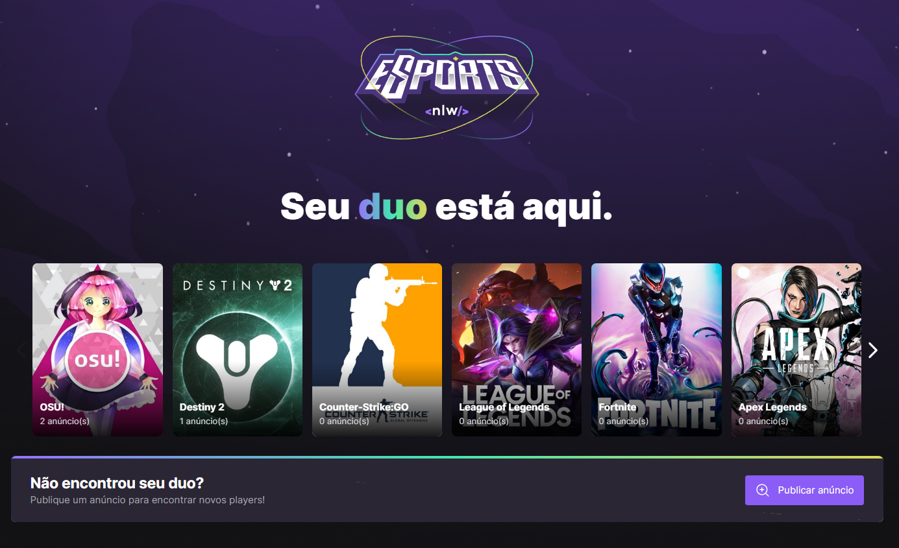
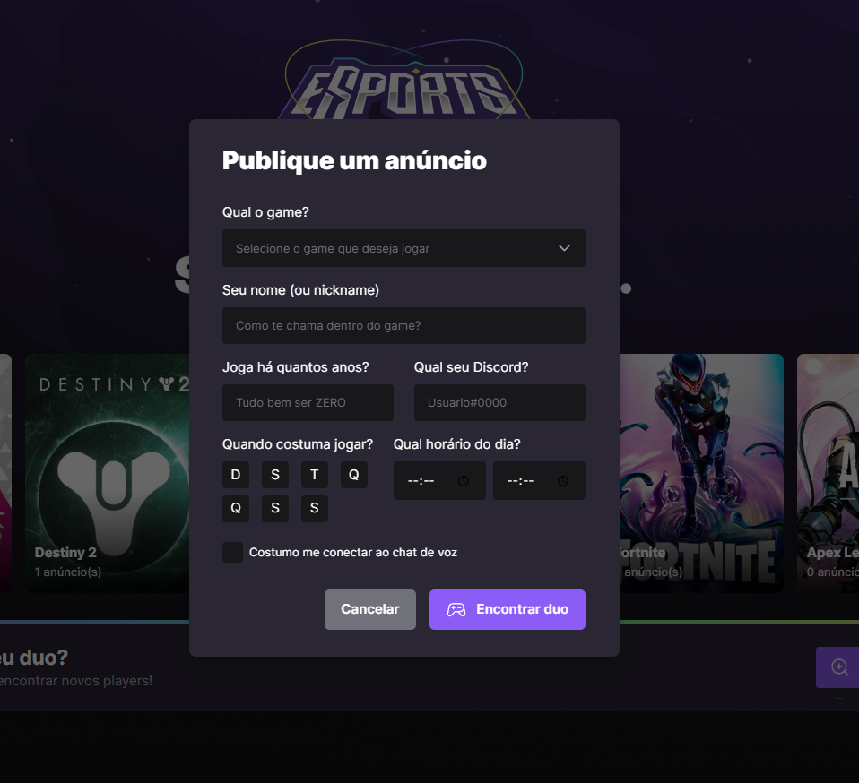
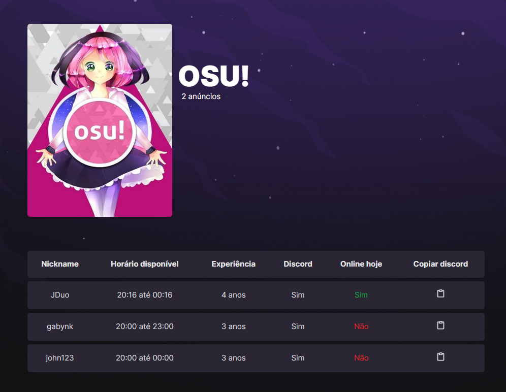

# esports
---

<div align="center">
 
</div>

<br><br>

## ✨💡 Functionalities 💡✨

---

<br>

This is a project about looking for a duo to play together. <br>
It was created in the nlw with [Rocketseat](https://www.rocketseat.com.br/) 💜

<br><br><br>
## 🛠️ Tecnology 🛠️

---

<br>

### Backend

- [Node.js](https://nodejs.org/en/)
- [Typescript](https://www.typescriptlang.org/)
- [Prisma](https://www.prisma.io/)

<br>

### Frontend

- [React](https://pt-br.reactjs.org/)
- [Typescript](https://www.typescriptlang.org/)
- [Tailwindcss](https://tailwindcss.com/)

<br>

### Mobile

- [React Native](https://reactnative.dev/)
- [Typescript](https://www.typescriptlang.org/)

<br><br><br>

## Imagens

---

<br>

<br><br>




<br><br>

<br>

## 🎲 Getting started 🎲

---

<br>

```bash
# project - web / server
npm install
npm run dev

# project - web / server
npm install
npx expo start
```

<br><br>


## Features

---

<br>

- [x] Responsive design
- [x] Slider in game banner
- [x] List game ads
- [ ] Auth with Discord

<br><br><br>

---

<p align="center">Developed with 💜 by Gabriele Nakassima </p>